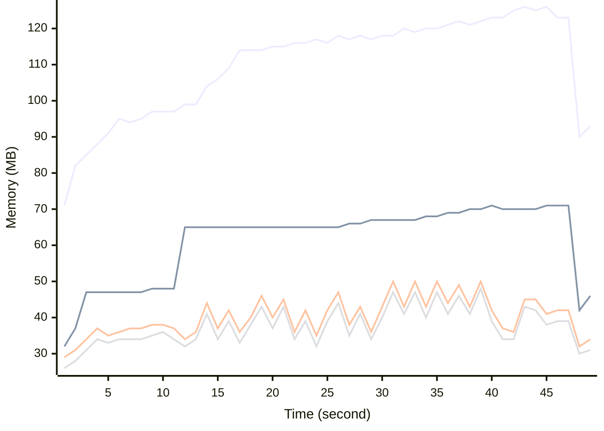

# Benchmark Report
> Generated by [`@nestia/benchmark`](https://github.com/samchon/nestia)

  - Specifications
    - CPU: AMD Ryzen 9 7940HS w/ Radeon 780M Graphics     
    - RAM: 31 GB
    - NodeJS Version: v20.10.0
    - Backend Server: 1 core / 1 thread
  - Arguments
    - Count: 1,024
    - Threads: 4
    - Simultaneous: 32
  - Time
    - Start: 2024-07-26T17:47:22.181Z
    - Complete: 2024-07-26T17:48:27.476Z
    - Elapsed: 65,295 ms

Type | Count | Success | Mean. | Stdev. | Minimum | Maximum
----|----|----|----|----|----|----
Total | 1,351 | 1,351 | 1,449.36 | 631.37 | 6 | 2,841

> Unit: milliseconds

## Memory Consumptions

> - 🟦 Resident Set Size
> - 🟢 Heap Total
> - 🔴 Heap Used + External
> - 🟡 Heap Used Only

## Endpoints
Type | Count | Success | Mean. | Stdev. | Minimum | Maximum
----|----|----|----|----|----|----
PUT /bbs/articles/:id | 30 | 30 | 1,956.03 | 441.51 | 780 | 2,461
POST /bbs/articles/:articleId/comments | 394 | 394 | 1,780.99 | 673.93 | 74 | 2,841
PUT /bbs/articles/:articleId/comments/:id | 68 | 68 | 1,558.64 | 266.8 | 772 | 2,169
POST /bbs/articles | 538 | 538 | 1,534.94 | 400.54 | 130 | 2,176
DELETE /bbs/articles/:articleId/comments/:id | 24 | 24 | 1,410.29 | 382.42 | 818 | 2,195
DELETE /bbs/articles/:id | 17 | 17 | 1,368.82 | 478.81 | 159 | 2,175
GET /bbs/articles/:articleId/comments/:id | 32 | 32 | 1,009.65 | 327.55 | 313 | 1,801
GET /bbs/articles/:id | 24 | 24 | 927.7 | 427.03 | 73 | 1,580
PATCH /bbs/articles/abridges | 49 | 49 | 865.26 | 438.26 | 81 | 1,611
PATCH /bbs/articles | 88 | 88 | 748.94 | 503.52 | 6 | 1,664
PATCH /bbs/articles/:articleId/comments | 65 | 65 | 577.61 | 417.37 | 6 | 1,470
GET /monitors/health | 11 | 11 | 424.72 | 263.94 | 35 | 810
GET /monitors/system | 11 | 11 | 336.45 | 204.68 | 48 | 779

> Unit: milliseconds

## Failures
Method | Path | Count | Failures
-------|------|-------|----------